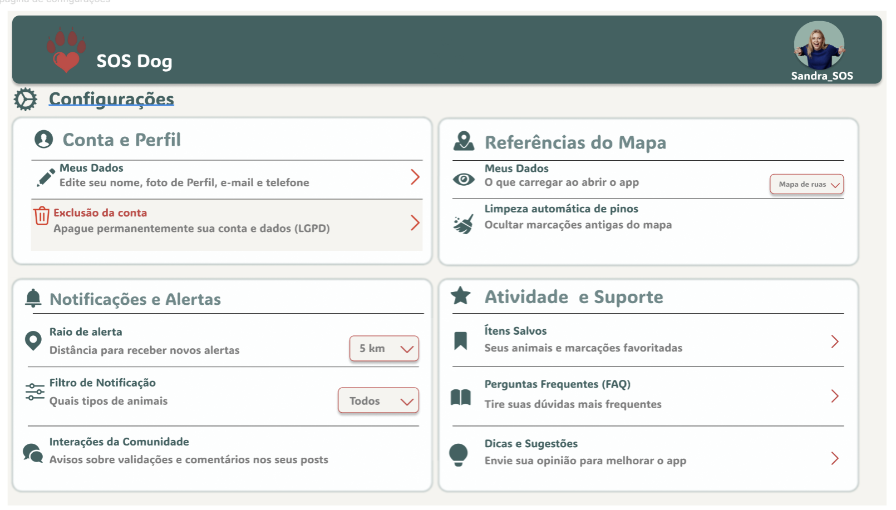

# Projeto de Interface

Pré-requisitos: <a href="2-Especificação do Projeto.md"> Documentação de Especificação</a>

Visão geral da interação do usuário pelas telas do sistema e protótipo interativo das telas com as funcionalidades que fazem parte do sistema (wireframes).

 Apresente as principais interfaces da plataforma. Discuta como ela foi elaborada de forma a atender os requisitos funcionais, não funcionais e histórias de usuário abordados nas <a href="2-Especificação do Projeto.md"> Documentação de Especificação</a>.

## Diagrama de Fluxo

O diagrama apresenta o estudo do fluxo de interação do usuário com o sistema interativo e  muitas vezes sem a necessidade do desenho do design das telas da interface. Isso permite que o design das interações seja bem planejado e gere impacto na qualidade no design do wireframe interativo que será desenvolvido logo em seguida.

O diagrama de fluxo pode ser desenvolvido com “boxes” que possuem internamente a indicação dos principais elementos de interface - tais como menus e acessos - e funcionalidades, tais como editar, pesquisar, filtrar, configurar - e a conexão entre esses boxes a partir do processo de interação. Você pode ver mais explicações e exemplos https://www.lucidchart.com/blog/how-to-make-a-user-flow-diagram.

As referências abaixo irão auxiliá-lo na geração do artefato “Diagramas de Fluxo”.

> **Links Úteis**:
> - [Fluxograma online: seis sites para fazer gráfico sem instalar nada | Produtividade | TechTudo](https://www.techtudo.com.br/listas/2019/03/fluxograma-online-seis-sites-para-fazer-grafico-sem-instalar-nada.ghtml)

## Wireframes

Os wireframes são protótipos utilizados no design de interfaces para representar a estrutura de um site e o relacionamento entre suas páginas. Eles funcionam como ilustrações do layout e da disposição dos elementos essenciais da interface.
Nesta seção, é FUNDAMENTAL indicar, para cada tela/wireframe proposto, quais requisitos do projeto estão sendo contemplados por aquela tela.

TELA PRINCIPAL

Plataforma de resgate animal: gerencia casos, buscas e adoções com mapas, galeria e suporte.

TELA DE LOGIN

interface com campos de usuário e senha, opções para lembrar login e recuperar acesso, além de um link para cadastro. 

TELA DE CADASTRO

No registro, o usuário pode fazer o cadastro com e-mail, telefone e selecionar seu perfil entre: adotante, voluntário, apoiador ou representante de instituição.

TELA DE PERFIL

Interface intuitiva para resgate animal: une monitoramento, feed de casos e geolocalização. Foca em urgências, adoção e cuidados colaborativos, facilitando a vida de ONGs e voluntários da causa.

TELA DE CONFIGURAÇÕES

> **Links Úteis**:
> - [Protótipos vs Wireframes](https://www.nngroup.com/videos/prototypes-vs-wireframes-ux-projects/)
> - [Ferramentas de Wireframes](https://rockcontent.com/blog/wireframes/)
> - [MarvelApp](https://marvelapp.com/developers/documentation/tutorials/)
> - [Figma](https://www.figma.com/)
> - [Adobe XD](https://www.adobe.com/br/products/xd.html#scroll)
> - [Axure](https://www.axure.com/edu) (Licença Educacional)
> - [InvisionApp](https://www.invisionapp.com/) (Licença Educacional)
