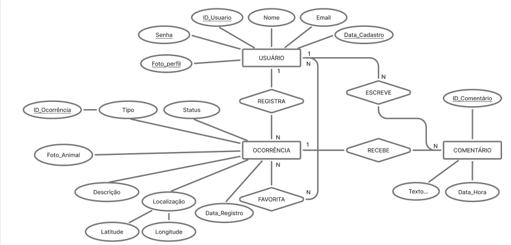

# Arquitetura da Solução

<span style="color:red">Pré-requisitos: <a href="3-Projeto de Interface.md"> Projeto de Interface</a></span>

Definição de como o software é estruturado em termos dos componentes que fazem parte da solução e do ambiente de hospedagem da aplicação.

## Diagrama de Classes

O diagrama UML acima descreve a estrutura estática do sistema, detalhando as classes Usuario, Tutor, Marcacao e seus relacionamentos. Ele estabelece as regras de herança e associações necessárias para a gestão de pets e registros de avistamentos, definindo atributos e métodos essenciais para a persistência e lógica de negócio da aplicação.


* ### Modelo Entidade Relacionamento

 

  Entidades Principais:
Usuário: Armazena as informações de perfil, credenciais de acesso e data de registro de quem utiliza a plataforma.

Ocorrência: O núcleo do sistema. Registra os detalhes do animal (foto, descrição), o status (aberto/resolvido) e a geolocalização (latitude/longitude) para facilitar o resgate ou encontro.

Comentário: Permite a interação social e a troca de informações em tempo real sobre uma ocorrência específica.

Favorito: Uma entidade de associação que permite aos usuários salvarem ocorrências de seu interesse para acompanhamento rápido.

Regras de Negócio e Relacionamentos:
Um para Muitos (1..N): * Um Usuário pode registrar várias Ocorrências, mas cada ocorrência pertence a apenas um autor.

Um Usuário pode escrever diversos Comentários.

Uma Ocorrência pode receber múltiplos Comentários de diferentes pessoas.

Muitos para Muitos (N..N):

A relação de Favoritos conecta Usuários e Ocorrências, permitindo que vários usuários favoritem a mesma postagem e que um único usuário tenha uma lista de várias postagens favoritas.


## Projeto da Base de Dados

  ```mermaid
   erDiagram
    USUARIO ||--o{ OCORRENCIA : "Registra"
    USUARIO ||--o{ COMENTARIO : "Escreve"
    USUARIO }|--o{ FAVORITO : "Salva"
    OCORRENCIA ||--o{ COMENTARIO : "Recebe"
    OCORRENCIA }|--o{ FAVORITO : "Eh Favoritado"

    USUARIO {
        int ID_Usuario PK
        string Nome
        string Email
        string Senha
        string Foto_Perfil
        datetime Data_Cadastro
    }

    OCORRENCIA {
        int ID_Ocorrencia PK
        string Tipo
        string Status
        string Foto_Animal
        string Descricao
        float Latitude
        float Longitude
        datetime Data_Registro
        int ID_Usuario FK
    }

    COMENTARIO {
        int ID_Comentario PK
        string Texto
        datetime Data_hora
        int ID_Usuario FK
        int ID_Ocorrencia FK
    }

    FAVORITO {
        int ID_Favorito PK
        int ID_Usuario FK
        int ID_Ocorrencia FK
    }
  ```

## ATENÇÃO!!!

Os três artefatos — **Diagrama de Classes, Modelo ER e Projeto da Base de Dados** — devem ser desenvolvidos de forma sequencial e integrada, garantindo total coerência e compatibilidade entre eles. O diagrama de classes orienta a estrutura e o comportamento do software; o modelo ER traduz essa estrutura para o nível conceitual dos dados; e o projeto da base de dados materializa essas definições no formato físico (tabelas, colunas, chaves e restrições). A construção isolada ou desconexa desses elementos pode gerar inconsistências, dificultar a implementação e comprometer a qualidade do sistema.

## Tecnologias Utilizadas

Descreva aqui qual(is) tecnologias você vai usar para resolver o seu problema, ou seja, implementar a sua solução. Liste todas as tecnologias envolvidas, linguagens a serem utilizadas, serviços web, frameworks, bibliotecas, IDEs de desenvolvimento, e ferramentas.

Apresente também uma figura explicando como as tecnologias estão relacionadas ou como uma interação do usuário com o sistema vai ser conduzida, por onde ela passa até retornar uma resposta ao usuário.

## Hospedagem

Explique como a hospedagem e o lançamento da plataforma foi feita.

> **Links Úteis**:
>
> - [Website com GitHub Pages](https://pages.github.com/)
> - [Programação colaborativa com Repl.it](https://repl.it/)
> - [Getting Started with Heroku](https://devcenter.heroku.com/start)
> - [Publicando Seu Site No Heroku](http://pythonclub.com.br/publicando-seu-hello-world-no-heroku.html)
