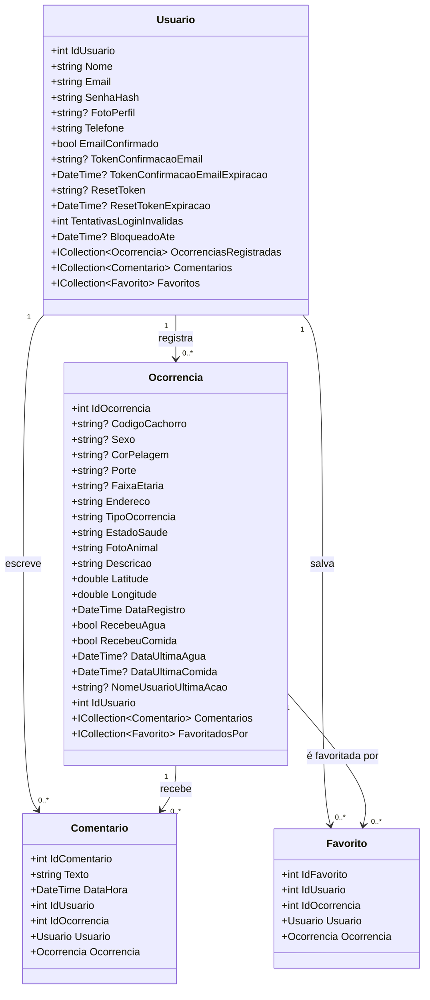
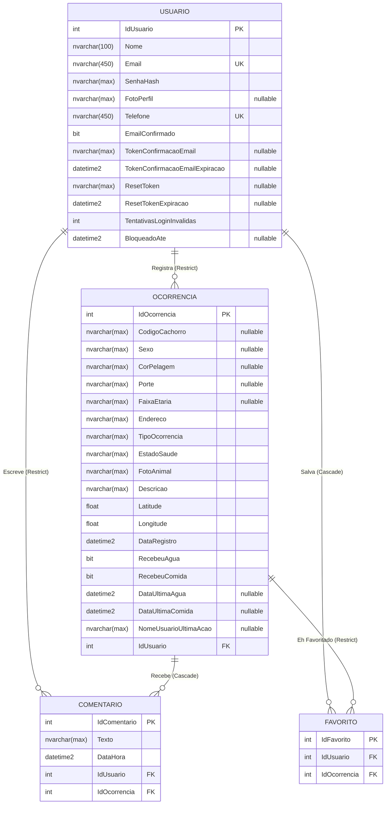

# Arquitetura da Solução

<span style="color:red">Pré-requisitos: <a href="3-Projeto de Interface.md"> Projeto de Interface</a></span>

Definição de como o software é estruturado em termos dos componentes que fazem parte da solução e do ambiente de hospedagem da aplicação.

---

## Diagrama de Classes


O diagrama abaixo descreve a estrutura estática do sistema SosDog. As quatro entidades principais — `Usuario`, `Ocorrencia`, `Comentario` e `Favorito` 


```mermaid
classDiagram
    class Usuario {
        +int IdUsuario
        +string Nome
        +string Email
        +string SenhaHash
        +string? FotoPerfil
        +string Telefone
        +bool EmailConfirmado
        +string? TokenConfirmacaoEmail
        +DateTime? TokenConfirmacaoEmailExpiracao
        +string? ResetToken
        +DateTime? ResetTokenExpiracao
        +int TentativasLoginInvalidas
        +DateTime? BloqueadoAte
        +ICollection~Ocorrencia~ OcorrenciasRegistradas
        +ICollection~Comentario~ Comentarios
        +ICollection~Favorito~ Favoritos
    }

    class Ocorrencia {
        +int IdOcorrencia
        +string? CodigoCachorro
        +string? Sexo
        +string? CorPelagem
        +string? Porte
        +string? FaixaEtaria
        +string Endereco
        +string TipoOcorrencia
        +string EstadoSaude
        +string FotoAnimal
        +string Descricao
        +double Latitude
        +double Longitude
        +DateTime DataRegistro
        +bool RecebeuAgua
        +bool RecebeuComida
        +DateTime? DataUltimaAgua
        +DateTime? DataUltimaComida
        +string? NomeUsuarioUltimaAcao
        +int IdUsuario
        +ICollection~Comentario~ Comentarios
        +ICollection~Favorito~ FavoritadosPor
    }

    class Comentario {
        +int IdComentario
        +string Texto
        +DateTime DataHora
        +int IdUsuario
        +int IdOcorrencia
        +Usuario Usuario
        +Ocorrencia Ocorrencia
    }

    class Favorito {
        +int IdFavorito
        +int IdUsuario
        +int IdOcorrencia
        +Usuario Usuario
        +Ocorrencia Ocorrencia
    }

    Usuario "1" --> "0..*" Ocorrencia : registra
    Usuario "1" --> "0..*" Comentario : escreve
    Usuario "1" --> "0..*" Favorito : salva
    Ocorrencia "1" --> "0..*" Comentario : recebe
    Ocorrencia "1" --> "0..*" Favorito : é favoritada por
```

> **Observação técnica:** A classe `Usuario` implementa controle de segurança completo, incluindo bloqueio por tentativas inválidas de login, confirmação de e-mail por token com expiração e fluxo de reset de senha — tudo persistido diretamente na entidade, sem tabela auxiliar.

---

## Modelo Entidade Relacionamento



```mermaid
erDiagram
    USUARIO ||--o{ OCORRENCIA : "Registra (Restrict)"
    USUARIO ||--o{ COMENTARIO : "Escreve (Restrict)"
    USUARIO ||--o{ FAVORITO : "Salva (Cascade)"
    OCORRENCIA ||--o{ COMENTARIO : "Recebe (Cascade)"
    OCORRENCIA ||--o{ FAVORITO : "Eh Favoritado (Restrict)"

    USUARIO {
        int IdUsuario PK
        nvarchar(100) Nome
        nvarchar(450) Email UK
        nvarchar(max) SenhaHash
        nvarchar(max) FotoPerfil "nullable"
        nvarchar(450) Telefone UK
        bit EmailConfirmado
        nvarchar(max) TokenConfirmacaoEmail "nullable"
        datetime2 TokenConfirmacaoEmailExpiracao "nullable"
        nvarchar(max) ResetToken "nullable"
        datetime2 ResetTokenExpiracao "nullable"
        int TentativasLoginInvalidas
        datetime2 BloqueadoAte "nullable"
    }

    OCORRENCIA {
        int IdOcorrencia PK
        nvarchar(max) CodigoCachorro "nullable"
        nvarchar(max) Sexo "nullable"
        nvarchar(max) CorPelagem "nullable"
        nvarchar(max) Porte "nullable"
        nvarchar(max) FaixaEtaria "nullable"
        nvarchar(max) Endereco
        nvarchar(max) TipoOcorrencia
        nvarchar(max) EstadoSaude
        nvarchar(max) FotoAnimal
        nvarchar(max) Descricao
        float Latitude
        float Longitude
        datetime2 DataRegistro
        bit RecebeuAgua
        bit RecebeuComida
        datetime2 DataUltimaAgua "nullable"
        datetime2 DataUltimaComida "nullable"
        nvarchar(max) NomeUsuarioUltimaAcao "nullable"
        int IdUsuario FK
    }

    COMENTARIO {
        int IdComentario PK
        nvarchar(max) Texto
        datetime2 DataHora
        int IdUsuario FK
        int IdOcorrencia FK
    }

    FAVORITO {
        int IdFavorito PK
        int IdUsuario FK
        int IdOcorrencia FK
    }
```

**Entidades Principais:**

**Usuario:** Armazena perfil, credenciais com hash de senha (nunca texto puro), telefone com índice único, e campos de segurança para confirmação de e-mail, reset de senha e bloqueio por tentativas inválidas de login.

**Ocorrencia:** Núcleo do sistema. Registra o animal (foto, tipo, estado de saúde, características físicas), geolocalização (latitude/longitude), endereço resolvido por geocodificação reversa, e o estado dos cuidados básicos recebidos (água, comida) com registro temporal.

**Comentario:** Permite interação em tempo real entre usuários sobre uma ocorrência específica. A deleção de uma ocorrência propaga em cascade para seus comentários.

**Favorito:** Tabela de associação N:N com constraint de unicidade no par `(IdUsuario, IdOcorrencia)` — garantindo que um usuário não favorite a mesma ocorrência duas vezes.

**Regras de integridade referencial (conforme Migration):**

- `FK_Ocorrencias_Usuarios_IdUsuario` → `Restrict` (não permite deletar usuário com ocorrências)
- `FK_Comentarios_Ocorrencias_IdOcorrencia` → `Cascade` (comentários deletados junto com a ocorrência)
- `FK_Comentarios_Usuarios_IdUsuario` → `Restrict`
- `FK_Favoritos_Usuarios_IdUsuario` → `Cascade` (favoritos deletados junto com o usuário)
- `FK_Favoritos_Ocorrencias_IdOcorrencia` → `Restrict`
- Índice único em `IX_Favoritos_IdUsuario_IdOcorrencia` → impede favorito duplicado

---

## Projeto da Base de Dados


```sql
CREATE TABLE Usuarios (
    IdUsuario              INT IDENTITY PRIMARY KEY,
    Nome                   NVARCHAR(100)  NOT NULL,
    Email                  NVARCHAR(450)  NOT NULL UNIQUE,
    SenhaHash              NVARCHAR(MAX)  NOT NULL,
    FotoPerfil             NVARCHAR(MAX)  NULL,
    Telefone               NVARCHAR(450)  NOT NULL UNIQUE,
    EmailConfirmado        BIT            NOT NULL DEFAULT 0,
    TokenConfirmacaoEmail  NVARCHAR(MAX)  NULL,
    TokenConfirmacaoEmailExpiracao DATETIME2 NULL,
    ResetToken             NVARCHAR(MAX)  NULL,
    ResetTokenExpiracao    DATETIME2      NULL,
    TentativasLoginInvalidas INT          NOT NULL DEFAULT 0,
    BloqueadoAte           DATETIME2      NULL
);

CREATE TABLE Ocorrencias (
    IdOcorrencia           INT IDENTITY PRIMARY KEY,
    CodigoCachorro         NVARCHAR(MAX)  NULL,
    Sexo                   NVARCHAR(MAX)  NULL,
    CorPelagem             NVARCHAR(MAX)  NULL,
    Porte                  NVARCHAR(MAX)  NULL,
    FaixaEtaria            NVARCHAR(MAX)  NULL,
    Endereco               NVARCHAR(MAX)  NOT NULL,
    TipoOcorrencia         NVARCHAR(MAX)  NOT NULL,
    EstadoSaude            NVARCHAR(MAX)  NOT NULL,
    FotoAnimal             NVARCHAR(MAX)  NOT NULL,
    Descricao              NVARCHAR(MAX)  NOT NULL,
    Latitude               FLOAT          NOT NULL,
    Longitude              FLOAT          NOT NULL,
    DataRegistro           DATETIME2      NOT NULL,
    RecebeuAgua            BIT            NOT NULL DEFAULT 0,
    RecebeuComida          BIT            NOT NULL DEFAULT 0,
    DataUltimaAgua         DATETIME2      NULL,
    DataUltimaComida       DATETIME2      NULL,
    NomeUsuarioUltimaAcao  NVARCHAR(MAX)  NULL,
    IdUsuario              INT            NOT NULL,
    CONSTRAINT FK_Ocorrencias_Usuarios
        FOREIGN KEY (IdUsuario) REFERENCES Usuarios(IdUsuario)
        ON DELETE NO ACTION  -- Restrict
);

CREATE TABLE Comentarios (
    IdComentario  INT IDENTITY PRIMARY KEY,
    Texto         NVARCHAR(MAX) NOT NULL,
    DataHora      DATETIME2     NOT NULL,
    IdUsuario     INT           NOT NULL,
    IdOcorrencia  INT           NOT NULL,
    CONSTRAINT FK_Comentarios_Usuarios
        FOREIGN KEY (IdUsuario) REFERENCES Usuarios(IdUsuario)
        ON DELETE NO ACTION,  -- Restrict
    CONSTRAINT FK_Comentarios_Ocorrencias
        FOREIGN KEY (IdOcorrencia) REFERENCES Ocorrencias(IdOcorrencia)
        ON DELETE CASCADE
);

CREATE TABLE Favoritos (
    IdFavorito    INT IDENTITY PRIMARY KEY,
    IdUsuario     INT NOT NULL,
    IdOcorrencia  INT NOT NULL,
    CONSTRAINT UQ_Favorito_Usuario_Ocorrencia
        UNIQUE (IdUsuario, IdOcorrencia),
    CONSTRAINT FK_Favoritos_Usuarios
        FOREIGN KEY (IdUsuario) REFERENCES Usuarios(IdUsuario)
        ON DELETE CASCADE,
    CONSTRAINT FK_Favoritos_Ocorrencias
        FOREIGN KEY (IdOcorrencia) REFERENCES Ocorrencias(IdOcorrencia)
        ON DELETE NO ACTION   -- Restrict
);

-- Índices gerados pelo EF Core
CREATE INDEX IX_Ocorrencias_IdUsuario          ON Ocorrencias(IdUsuario);
CREATE INDEX IX_Comentarios_IdOcorrencia       ON Comentarios(IdOcorrencia);
CREATE INDEX IX_Comentarios_IdUsuario          ON Comentarios(IdUsuario);
CREATE INDEX IX_Favoritos_IdOcorrencia         ON Favoritos(IdOcorrencia);
```


---

## Tecnologias Utilizadas

O SosDog é uma aplicação web MVC construída sobre o ecossistema .NET 10, com persistência em SQL Server e interações dinâmicas via JavaScript no front-end.

**Back-end:**

- **ASP.NET Core 10 (MVC)** — framework principal, responsável pelo roteamento, controllers e views Razor.
- **Entity Framework Core** — ORM para mapeamento objeto-relacional, migrations e acesso ao banco de dados.
- **Microsoft SQL Server** — banco de dados relacional, com a connection string `DefaultConnection` configurada via `appsettings.json`.
- **ASP.NET Core Cookie Authentication** — autenticação stateful com cookie `SosDogAuth`, protegendo rotas com `[Authorize]`. Inclui fluxo completo de confirmação de e-mail e reset de senha via token.
- **BCrypt / SHA** — hash de senhas (`SenhaHash`), nunca armazenadas em texto puro.
- **IHttpClientFactory** — utilizado no `OcorrenciasController` para chamadas HTTP externas (geocodificação reversa de endereço a partir de latitude/longitude).
- **IWebHostEnvironment** — gestão de upload de imagens (fotos do animal e foto de perfil) salvas no sistema de arquivos do servidor.

**Front-end:**

- **Razor Views (.cshtml)** — templating server-side com HTML, C# e Tag Helpers.
- **jQuery** — manipulação do DOM e requisições AJAX (ex: listagem de comentários por ocorrência via `XMLHttpRequest`).
- **jQuery Validation + Unobtrusive Validation** — validação de formulários no lado do cliente, integrada ao Data Annotations do ASP.NET.
- **Bootstrap** — framework CSS para layout responsivo e componentes visuais.
- **JavaScript nativo** — lógica de mapa, favoritar/desfavoritar via AJAX (`FavoritosController.Alternar`), e geração de cartaz de animal desaparecido (`OcorrenciasController.Cartaz`).

**Ferramentas e infraestrutura:**

- **Visual Studio / Rider** — IDE de desenvolvimento.
- **EF Core Migrations** — controle de versão do schema do banco, com migration inicial `20260512000929_1m@`.
- **Razor Runtime Compilation** — habilitado via `AddRazorRuntimeCompilation()` para hot-reload das views em desenvolvimento.

**Diagrama de interação (fluxo de uma requisição):**

```
Usuário (Browser)
      │
      │  HTTP Request (HTTPS)
      ▼
ASP.NET Core Pipeline
  ├─ UseHttpsRedirection
  ├─ UseStaticFiles  ──────────────► wwwroot/ (CSS, JS, imagens)
  ├─ UseRouting
  ├─ UseAuthentication  ──────────► Cookie "SosDogAuth"
  └─ UseAuthorization
      │
      ▼
Controller (ex: OcorrenciasController)
  ├─ Valida modelo (Data Annotations)
  ├─ Chama AppDbContext (EF Core)  ──► SQL Server
  ├─ (opcional) IHttpClientFactory  ──► API de Geocodificação
  └─ Retorna View (Razor) ou JSON
      │
      ▼
Razor View (.cshtml)
  └─ Renderiza HTML + dados
      │
      ▼
Usuário (Browser) ◄── Response HTML / JSON
```

---

## Hospedagem

Explique como a hospedagem e o lançamento da plataforma foi feita.

> **Links Úteis**:
>
> - [Website com GitHub Pages](https://pages.github.com/)
> - [Programação colaborativa com Repl.it](https://repl.it/)
> - [Getting Started with Heroku](https://devcenter.heroku.com/start)
> - [Publicando Seu Site No Heroku](http://pythonclub.com.br/publicando-seu-hello-world-no-heroku.html)
